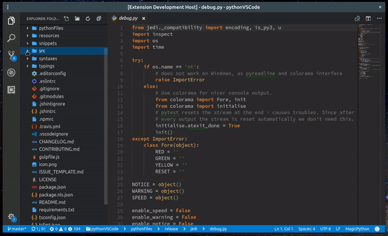

# Status Bar Breadcrumb README

> **ATTENTION** now this extension is deprecated thus will not be maintained anymore, use it on your own risk

> **Why?** If you are really interested why: since July 2018 VSCode released official support for breadcrumbs with more features like language extension integration, code navigation etc so this become useless.

> **But** thanks for all those, who found this extension helpful. Thank you very much!

Annoying of missing something like this feature [Nav toolbar](https://github.com/Microsoft/vscode/pull/31162)?
This extension provides temporary solution for navigation using breadcrumb in status bar.

## Features

It's intended to demolish the lack of breadcrumb navigation like IntelliJIdea or Eclipce etc. have.

Like IntelliJIdea, this extension shows current file path in status bar splited into breadcrumb items. Clicking on item will open navigation menu built using VS Code Quick Pick items.

## Extension Settings

This extension is using next settings:

* `files.exclude`: list of globs patterns for excluding files and folders from navigation menu
* `statusBarBreadcrumb.additionalFilesExclude`: additional list of glob pattern to exclude files

## Known Issues

1. If path long enough last items will not fit into status bar and become invisible.
2. It would be nice to show file icons in navigation menu like explorer did, but, currently, only folders have icons.
